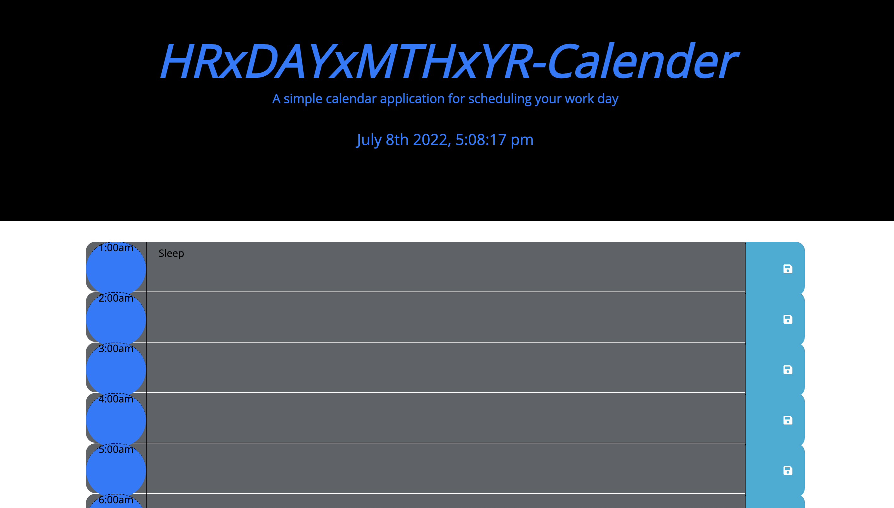

# hrxdayxmthxyr-Calender

A basic calender to help you manage your time through out the day.This app will run in the browser and feature dynamically updated HTML and CSS powered by jQuery.

This calender includes 24hr time blocks to help you organize your day. Updated with standard html, css, js, and jquer.

As a result this will let you add events and allow you to save them in each time block.

